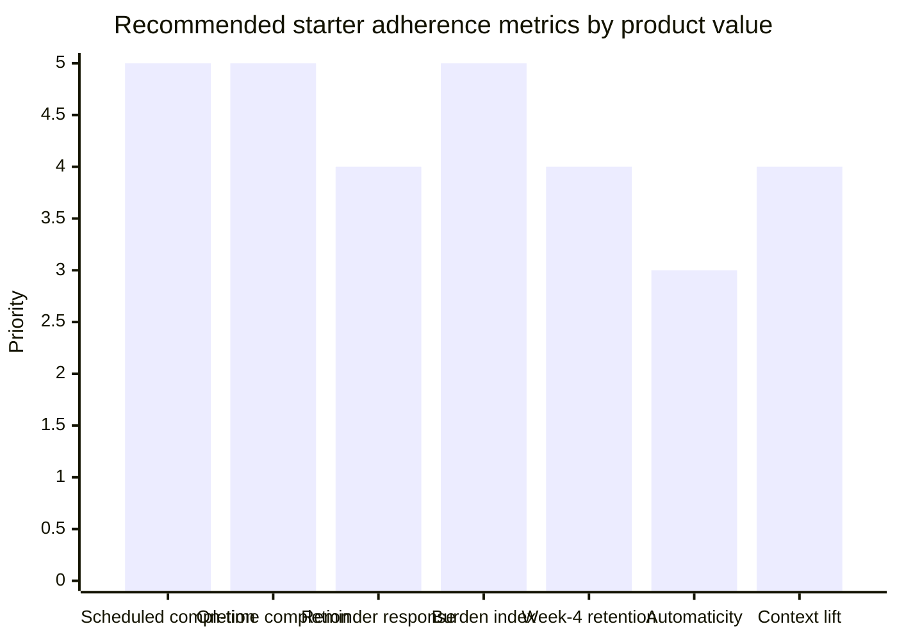
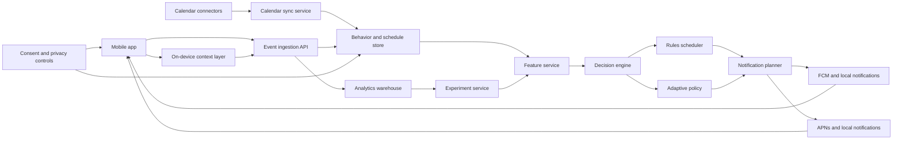
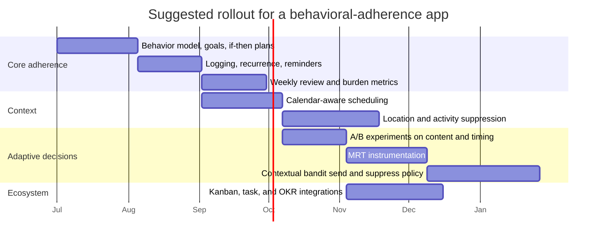

# Behavioral Adherence Application Design Research

## Executive Summary

The strongest evidence for a behavioral-adherence product does **not** point to any single branded productivity method as the core engine. It points instead to a recurring set of behavior-change components: **goal setting, self-monitoring, feedback, prompts or cues, rewards, and social support**. In a 2023 systematic review of mobile health apps, those were the behavior change techniques most repeatedly associated with engagement. A 2024 systematic review of digital habit-formation interventions similarly found that **self-monitoring, goal setting, and prompts/cues** were the most common design ingredients, often implemented through automatic monitoring, descriptive feedback, time-based cues, and virtual rewards. citeturn32view0turn32view1

For a new adherence app, the most defensible theory stack is: **specific and measurable goals**, **implementation intentions** such as “if X, then I will do Y,” **stable context cues** that support habit formation, and **just-in-time adaptive intervention** logic that decides whether to intervene based on the user’s current context and receptivity. Goal-setting research found that more difficult goals tended to produce higher effort and performance, with meta-analytic effect sizes ranging from **d = .52 to .82**. A meta-analysis of implementation intentions found a **medium-to-large positive effect on goal attainment** of **d = .65**. In the classic real-world habit-formation study by Lally and colleagues, the **median time to reach 95% of automaticity asymptote was 66 days**, but the range was very wide, from **18 to 254 days**, which argues against simplistic “21-day habit” assumptions. citeturn34view0turn28search12turn34view3turn34view4

The best product shape is therefore **context-aware but not surveillance-heavy**. The MVP should combine reliable recurring scheduling, one-tap self-monitoring, calendar-aware availability windows, context cues such as “after breakfast” or “in the gym area,” clear completion and snooze actions, and weekly review loops. Passive sensing should initially serve two purposes: **suppress bad reminders** when the user is busy, driving, or in a meeting, and **upgrade useful reminders** when context is strongly favorable. That approach aligns with the just-in-time adaptive intervention literature, with HeartSteps-style adaptive delivery, and with mobile platform constraints around geofencing, activity recognition, background work, and notifications. citeturn9search4turn29search13turn41search5turn17search1turn17search12turn20search2turn20search1

For reinforcement, the research supports **contingent feedback and progressive mastery signals**, but not a product that leans primarily on controlling rewards. Contingency-management research shows strong adherence benefits in clinical settings, including chronic conditions and treatment attendance, yet self-determination theory and the classic Deci-Koestner-Ryan meta-analysis both warn that some forms of extrinsic reward can undermine intrinsic motivation when they become overly controlling. A 2022 meta-analysis reported that nudges and choice architecture interventions produce a **small-to-medium average effect** on behavior change, but a contemporaneous critique argued that publication bias may materially overstate this effect. That means your app should use nudges and rewards as **supporting primitives**, not as the sole adherence strategy. citeturn37search12turn36search17turn37search11turn34view1turn34view2turn4search3turn4search15

Popular methods such as **Pomodoro, Eisenhower, Kanban, Scrum, OKRs, and time blocking** are still useful, but mainly as interaction shells around those deeper mechanisms. Time management overall has a **moderate relationship** with job performance, academic achievement, and well-being, and a moderate negative relationship with distress, but direct evidence for some named frameworks is much thinner than evidence for component mechanisms. Pomodoro-specific evidence is mixed, while the evidence for **micro-breaks** is stronger and more stable. The practical implication is straightforward: build a system that can **express** these methods, instead of hard-coding one method as the theory of change. citeturn8view0turn7search2turn7search6turn9search2

## Psychological Theory and Evidence

A behavior-adherence app should be built from a small set of theories that explain **why people start**, **why they continue**, and **why they miss behaviors even when they intended to do them**. The most directly useful synthesis is: **Fogg’s behavior model** for initiation and trigger timing; **self-determination theory** for motivation quality; **goal-setting theory** for outcome structure; **implementation intentions and WOOP/MCII** for converting intention into action; **habit theory** for automaticity through stable cues; **operant conditioning and contingency reinforcement** for consequences; and **JITAI logic** for timing interventions to situation and receptivity. citeturn34view5turn34view1turn34view2turn34view0turn28search12turn31search0turn34view3turn9search4

Fogg’s model is unusually practical for product design because it states that behavior occurs when **motivation, ability, and a trigger** are present at the same moment. That idea maps directly to reminder design: when the task feels too hard, a reminder should often **reduce the task**, **change the timing**, or **offer a smaller next step**, instead of simply repeating the same alert. Self-determination theory adds the crucial distinction between “more motivation” and “better motivation”: behavior is more likely to persist when the product supports **autonomy, competence, and relatedness**, and when feedback feels informational rather than controlling. citeturn34view5turn34view1turn34view2

Habit formation research matters because adherence apps often over-index on time-based reminders and under-index on **cue stability**. In the Lally study, participants repeated a chosen behavior in the **same context** for 12 weeks, and automaticity rose asymptotically. The paper explicitly notes that the study selected **situations rather than times** as cues because situations allow external cueing of intended action, whereas pure time cues require active monitoring. That is a strong argument for context-aware reminders like “when I leave work,” “after breakfast,” or “when I enter the gym,” rather than naked clock alerts whenever the platform and privacy model allow it. citeturn34view3turn34view4

The table below translates the main theories into product-level implications.

| Mechanism | What the evidence says | Product implication | Sources |
|---|---|---|---|
| Specific, challenging goals | Specific and difficult goals outperform vague “do your best” goals; reported meta-analytic effect sizes ranged from **d = .52 to .82**. | Require every behavior to have a clear target, cadence, and measurable success condition. | citeturn34view0turn33view9 |
| Implementation intentions | If-then plans improved goal attainment with **d = .65**; MCII or WOOP also shows a positive effect on goal attainment. | During setup, force one concrete cue-action plan per behavior. | citeturn28search12turn31search0turn31search17 |
| Stable context repetition | Habit automaticity increased over time, with a median **66 days** to 95% asymptote and wide individual variation. | Use situation-linked recurrence and avoid promising fixed “habit in 21 days” timelines. | citeturn34view3turn34view4 |
| Self-monitoring, feedback, prompts/cues | These are among the most repeatedly associated BCTs for engagement in mobile health and digital habit interventions. | Make logging one tap; connect every reminder to immediate feedback and visible progress. | citeturn32view0turn32view1 |
| JITAI adaptation | Interventions should provide the right support, at the right time, by adapting to changing internal and contextual state. | Model **decision points**, **tailoring variables**, **availability**, and **burden**, not just schedules. | citeturn9search4turn5search14turn29search13 |
| Positive reinforcement | Contingency management improves adherence in several domains, including attendance and chronic-condition adherence. | Reward verified behavior completion or progress; avoid noisy reward systems disconnected from the target outcome. | citeturn36search17turn37search12turn36search24 |
| Autonomy-supportive motivation | Autonomy, competence, and relatedness support higher quality motivation; controlling rewards can undermine intrinsic motivation. | Phrase feedback as progress and mastery, not pressure or guilt. Keep rewards optional and informational. | citeturn34view1turn34view2turn37search11 |
| Nudges and defaults | Choice architecture shows average positive effects, but effect estimates are disputed due to possible publication bias. | Use defaults, friction reduction, and suggestion ordering as helpers, not as the primary adherence mechanism. | citeturn4search3turn4search15 |
| Focus intervals and breaks | Micro-breaks improve vigor and reduce fatigue; Pomodoro-specific studies are mixed. | Offer timers as a configurable option, not as the app’s mandatory model. | citeturn9search2turn7search2turn7search6 |

One additional point matters for product rigor: the evidence base is much stronger for **behavior-change components** than for most branded productivity systems. That is why the most robust design stance is modular. Let users express “Pomodoro,” “time blocking,” “Kanban,” or “OKR review,” but keep the internal behavior engine grounded in measurable constructs like cue strength, reminder responsiveness, schedule adherence, automaticity, burden, and retention. citeturn8view0turn32view0turn32view1

## Time and Behavior Management Methods

A comprehensive scan of time and behavior management methods shows that they solve different parts of the adherence problem. Some methods mainly improve **task initiation**. Others reduce **overcommitment**, increase **flow visibility**, or create a **review cadence**. Very few are full-stack behavior systems on their own. citeturn8view0turn33view7turn33view8

| Method | Primary function | Evidence signal | Best use in your app | Sources |
|---|---|---|---|---|
| Time blocking | Converts intentions into protected calendar windows and reduces unscheduled drift. | Direct framework-specific trials are sparse, but time management overall is moderately associated with performance and well-being. | Core scheduling layer for planned behaviors and focused work blocks. | citeturn8view0turn27search0 |
| Pomodoro | Short focus intervals plus short breaks; combats initiation friction and time blindness. | Direct evidence remains mixed; some recent reviews are favorable, but at least one recent experimental study reported worse fatigue and motivation trajectories versus alternatives. | Optional timer mode with user-tunable interval length. | citeturn7search2turn7search6turn9search2 |
| Micro-breaks | Attention recovery and fatigue management. | Stronger evidence than Pomodoro branding itself; meta-analysis supports well-being gains and conditional performance benefits. | Break guidance within focus sessions; recovery recommendations after long work bouts. | citeturn9search2 |
| Eisenhower matrix | Urgency/importance sorting; reduces urgency trap and overreaction to incoming tasks. | Useful conceptual heuristic; direct controlled evidence is limited. | Prioritization UI for backlogs and weekly review. | citeturn26search2turn26search6 |
| Implementation intentions / WOOP | Bridges intention to action and prepares for obstacles. | Strong evidence for follow-through; MCII or WOOP is consistently positive in meta-analytic work. | Onboarding and weekly replanning wizard. | citeturn28search12turn31search0turn31search17 |
| Cue-based habit stacking | Attaches behavior to stable routine cues. | Strong habit-formation logic and direct real-world evidence for context repetition. | Best for self-care, admin routines, meds, exercise, and checklists. | citeturn34view3turn34view4 |
| Kanban with WIP limits | Makes work visible and prevents overloading concurrent tasks. | Official Kanban guidance emphasizes flow, pull, and WIP limits; evidence is strongest as process logic rather than RCT-style behavior science. | Excellent for multi-step goals and backlog-style personal systems. | citeturn33view8turn25search2turn25search14 |
| Scrum cadence | Creates short planning cycles, commitment windows, review, and shared “done.” | Strong framework definition; useful for cadence and accountability, especially in teams. | Weekly review, sprint goal, and retro patterns for shared projects. | citeturn33view7 |
| OKRs | Aligns behaviors with outcomes through measurable key results. | Goal-setting theory strongly supports the underlying structure of specific, challenging goals with measurable progress. | Best for monthly or quarterly review, not daily intervention. | citeturn34view0turn33view9 |

For a behavior-adherence product, the most valuable imports from project-management frameworks are **Kanban-style flow visibility**, **WIP limits**, **Scrum-like review cadence**, and **OKR-style measurable outcomes**. Full Scrum is often too heavy for solo users unless translated into a lightweight weekly-review ritual. OKRs are useful above the habit layer, as a way to connect daily behaviors to quarterly outcomes. Kanban is the most naturally compatible project framework because it supports multi-step behaviors, blocked states, and work-in-progress constraints without assuming a full team ceremony model. citeturn25search2turn25search6turn33view7turn33view8turn33view9

A good behavioral-adherence app should therefore let users operate at **three linked levels**: the **behavior** level for repeated actions, the **project** level for multi-step outcomes, and the **goal** level for OKRs or broader objectives. That structure avoids the common error of forcing habits, tasks, and projects into a single undifferentiated to-do list. citeturn8view0turn33view9turn33view8

## Current Tools and Product Design Patterns

The current app landscape clusters into four archetypes: **reminder-centric tools**, **project/workflow tools**, **auto-scheduling systems**, and **focus-enforcement tools**. Each archetype solves a different part of the adherence loop, and none fully solves all of them. The practical lesson is to combine their strongest features in a single coherent architecture instead of copying any one tool. citeturn15search3turn11search3turn13search0turn16search9turn14search0turn15search1

| Tool | What it does well | Context awareness | Automation pattern | Design lesson for your app | Sources |
|---|---|---|---|---|---|
| Apple Reminders | Time and location alerts, subtasks, Siri capture, list-based checklists. | Strong for time and location reminders. | Simple direct recurrence and local reminder logic. | Fast capture and context-linked reminders are valuable, but analytics and adaptation are minimal. | citeturn15search3turn15search10turn15search13 |
| Todoist | Recurring dates based on scheduled date or completion date, reminders, distinction between recurring dates and hard deadlines. | Mostly schedule-based. | Recurrence and reminder automation around tasks. | Completion-based recurrence is especially important for habits that should reset **after doing**, not just after a date passes. | citeturn11search0turn11search3turn11search6turn11search15 |
| Asana | Rules with triggers/actions, due-soon automation, branching logic, timeline visualization. | Mostly workflow and due-date context. | Rule engine around project state changes. | Event-driven automation is a strong pattern for team adherence and project follow-through. | citeturn13search0turn13search11turn13search12turn13search16 |
| Trello | Built-in no-code automation with rules, scheduled automations, due-date automations, visual boards. | Limited personal context; strong workflow context. | Trigger-action board automation. | Visual flow plus scheduled automation is useful for project-type behaviors and blockers. | citeturn11search1turn11search16turn11search7 |
| Notion | Reminders with `@remind`, date properties, database automations, calendar integration. | Mostly object and date context. | Database-triggered automations. | Rich object model is good for custom schemas, but behavior intervention logic is relatively weak. | citeturn11search2turn11search5turn11search8turn11search20 |
| Motion | Continuous automatic scheduling based on tasks, deadlines, priorities, and available time; schedule updates as work changes. | Strong calendar/time context. | Dynamic scheduler. | Auto-rescheduling is one of the highest-value differentiators for an adherence app. | citeturn16search9turn16search5 |
| RescueTime | Focus Zones based on calendar gaps and work patterns; productivity alerts; automated focus sessions. | Strong for calendar plus behavioral productivity context. | Detect-opportunity and nudge. | The strongest market pattern here is not blocking, but identifying **high-receptivity windows**. | citeturn14search0turn14search2turn14search4turn14search8turn14search10 |
| Freedom | Recurring block sessions, always-on schedules, locked mode, cross-device commitment device. | Weak real-world context, strong deliberate restriction context. | Scheduled enforcement. | Commitment devices are useful for avoidance behaviors such as “don’t open X during work blocks.” | citeturn15search1turn15search11turn15search15turn15search18 |

The most important UI pattern across these tools is that the interface works best when it answers **one immediate question**: *what is the next action right now?* That is consistent with the behavior-change literature emphasizing prompts, self-monitoring, and feedback, and with products like Motion and RescueTime that elevate the “best next moment” rather than merely storing a large list. For your app, the home screen should center on **today’s next recommended action**, the reason it is being recommended now, and extremely low-friction action buttons such as **Done**, **Snooze**, **Skip**, and **Reschedule**. citeturn32view0turn32view1turn16search9turn14search0

Notification design should be conservative and user-controlled. Apple’s Human Interface Guidelines say that if you use a custom sound, it should be **short, distinctive, and professionally produced**, and that you should not rely on sound alone. Apple also supports **Passive, Active, Time Sensitive, and Critical** interruption levels, with **Critical** requiring a specific entitlement and therefore being inappropriate for ordinary adherence workflows. On Android, notification channels are required for modern apps, and Google’s design guidance explicitly tells developers to consider the purpose of notifications and the right point in the user journey to request permission. That strongly supports a design in which routine habits default to silent or passive delivery, higher-value behaviors use sound only if the user opts in, and notification permission is requested **after** the user experiences the benefit. citeturn24search0turn24search13turn24search17turn24search1turn19search0

Gamification should be used primarily to support **competence** and **continuity**, not compulsive engagement. The most robust form is informational feedback: streaks, progress bars, level-ups, checkmarks, completion histories, and small collections tied to verified behaviors. Research on gamification in physical-activity interventions is broadly positive, but the self-determination literature and extrinsic-reward meta-analytic work argue against making users feel controlled by the reward system. In practice, that means your app should prefer **mastery** over **loot**, and should offer graceful recovery after missed days rather than brittle “all-or-nothing” streak logic. citeturn9search1turn9search25turn34view1turn37search11

The feature set below is the most defensible balance of impact and implementation feasibility for an early product.

| Feature | Why it matters | Impact | Feasibility | MVP priority | Sources |
|---|---|---:|---:|---|---|
| Behavior setup with measurable target and one if-then cue | Converts vague intention into a monitorable behavior with a stable trigger. | High | High | Immediate | citeturn34view0turn28search12turn34view3 |
| One-tap logging with immediate feedback | Self-monitoring and feedback are repeatedly associated with engagement. | High | High | Immediate | citeturn32view0turn32view1 |
| Completion-based recurrence | Many habits should recur from completion, not just from scheduled date. | High | High | Immediate | citeturn11search0turn11search15 |
| Calendar-aware availability windows | Prevents reminders from firing during meetings or obvious conflict periods. | High | Medium | Immediate | citeturn14search0turn18search1turn18search4 |
| Reminder actions with explanation | Supports transparency, better data, and less reminder fatigue. | High | Medium | Immediate | citeturn32view0turn23search14turn23search9 |
| Weekly review with behavior and burden analytics | Time management helps most when users revisit plans and see progress versus overload. | High | Medium | Immediate | citeturn8view0turn33view7turn33view9 |
| Configurable focus session timer | Useful for initiation and protected work, but should remain optional due mixed Pomodoro evidence. | Medium | High | Near-term | citeturn7search2turn7search6turn9search2 |
| Soft gamification tied to verified completion | Reinforces progress without over-controlling the experience. | Medium | High | Near-term | citeturn9search1turn37search11 |
| Location and activity context cues | Strong for routine-linked habits and suppressing bad reminders. | High | Medium | Near-term | citeturn34view4turn17search1turn17search12turn15search13 |
| Adaptive send-time and content personalization | JITAI and RL literature suggests personalization can improve response quality. | High | Medium | After telemetry quality is good | citeturn29search13turn41search0turn41search19 |
| PM integrations with Kanban, tasks, and OKRs | Connects daily adherence to real projects and measured outcomes. | Medium | Medium | After core adherence loop works | citeturn33view8turn33view9turn13search0turn11search1 |
| Strong privacy and attention controls | Required for trust and regulatory resilience, especially with passive context sensing. | High | Medium | Immediate | citeturn21search0turn23search2turn23search14 |

The following user flows are the ones most worth prototyping first. They are a synthesis of the behavior-change literature, JITAI design, and the strongest product patterns in current tools. citeturn32view0turn32view1turn9search4turn14search0turn16search9

| Flow | Sequence | Wireframe description | What it tests |
|---|---|---|---|
| Habit setup | Create behavior → define success metric → choose cue → choose reminder style → notification consent | Screen 1: behavior title and “what counts as done.” Screen 2: one if-then plan with a suggestion picker such as “after breakfast,” “when I reach the office,” or “during first free calendar gap.” Screen 3: reminder style options from passive to audible. | Whether the app can establish a clear behavior model and a cue-based recurrence from the start. |
| Focus session start | View recommended task → accept session → run timer → complete or reschedule | Home screen shows one recommended action with a “Why now?” explainer, a duration estimate, and buttons for Start, Snooze, and Reschedule. Session screen shows timer, subtasks, distraction block toggle, and micro-break cue. | Whether next-action reduction plus timing support improves initiation. |
| Weekly review | See adherence dashboard → inspect misses and burden → adjust rules | Review screen shows completion rate, on-time rate, streak survival, burden index, skipped contexts, and a recommendation strip such as “move this reminder to your post-lunch window.” | Whether the app can improve adherence by adapting schedules rather than only sending more reminders. |

## Adherence Metrics and Experimentation

One of the biggest problems in this product category is that teams often confuse **engagement** with **adherence**. The literature on digital interventions repeatedly notes that engagement is multi-faceted, spanning affective, cognitive, and behavioral dimensions, and that app-use counts alone fail to capture the full picture. A sound adherence product should track at least four distinct families of outcomes: **behavior completion**, **timing quality**, **retention**, and **burden**. It should also measure **habit strength** directly, for example with the Self-Report Behavioural Automaticity Index, because long-term success depends on whether the behavior becomes easier and less effortful over time. citeturn32view0turn6search4turn29search21

| Metric | Operational definition | Why it matters | Caveat |
|---|---|---|---|
| Scheduled completion rate | Completed behaviors / scheduled behaviors in a period | The most direct adherence KPI for intended actions | Inflated if scheduling is too conservative |
| On-time completion rate | Completions inside target window / total completions | Separates “eventual completion” from true schedule adherence | Needs behavior-specific window rules |
| Reminder response rate | Completions within X minutes or hours after reminder / reminders delivered | Measures message effectiveness at the moment of intervention | Can reward spam if not paired with burden metrics |
| Burden index | Weighted combination of dismisses, repeated snoozes, muted channels, and notification disables | Protects against alert fatigue and manipulative overdelivery | Requires careful weighting |
| Retention survival | Time-to-churn or time-to-last-meaningful-action, analyzed with survival methods | More robust than Day-1/7/30 snapshots for longitudinal stickiness | Needs a clear definition of “meaningful action” |
| Habit automaticity | SRBAI or similar score trend over weeks | Measures whether reliance on conscious effort is actually decreasing | Self-report adds response burden |
| Context lift | Difference in completion probability for context-matched reminders versus baseline | Quantifies value of context awareness | Needs enough intervention data across contexts |
| Schedule slippage | Actual start time minus planned start time | Detects chronic over-optimism and poor duration estimates | Requires time capture, not just completion |
| Review utilization | Share of users completing weekly review and making schedule changes | Indicates whether the app’s learning loop is active | Weekly review is not equally relevant for all users |

The chart below is a **product-priority chart**, not an effect-size chart. It reflects which metrics are most valuable to instrument early, based on the literature’s emphasis on self-monitoring, prompts, retention, and automaticity, plus the practical need to protect user attention. citeturn32view0turn32view1turn6search2turn29search21

For experimentation, the right progression is **A/B tests first, micro-randomized trials next, contextual bandits later**. Standard A/B tests are appropriate for onboarding copy, sound defaults, or reminder styles. But once the app begins making repeated reminder decisions across the day, **micro-randomized trials** become more appropriate because they estimate whether an intervention works **at specific decision points and in specific contexts**. That is the core methodological contribution of the JITAI literature. Retention should be analyzed with **survival analysis**, and the product should treat burden metrics as **hard guardrails** rather than secondary nice-to-have measures. citeturn5search3turn29search13turn41search5turn6search2

## Architecture and Implementation

If context-aware reinforcement is central to the product, a **mobile-first native build** is the strongest technical option. iOS and Android expose the needed capabilities through platform-specific frameworks: **Core Location**, **Core Motion**, **EventKit**, **UserNotifications**, **BackgroundTasks** on Apple platforms, and **Geofencing**, **Activity Recognition**, **Notification Channels**, **WorkManager**, and **FCM** on Android and cross-platform notification paths. A cross-platform client can absolutely work, but it still requires native bridges for geofencing, motion, calendar access, and advanced notification behavior. citeturn17search2turn17search10turn17search14turn18search4turn18search10turn20search1turn17search1turn17search12turn19search0turn20search2turn17search3

| Platform strategy | Advantages | Main constraints | Best fit |
|---|---|---|---|
| Native iOS + Android | Best access to calendars, geofences, activity state, interruption levels, and background behavior | Highest implementation cost | Context-aware reminders and sensor-heavy adherence products |
| Cross-platform mobile | Faster shared UI, faster MVP iteration, easier product experimentation | Still needs native modules for notifications, geofencing, motion, and calendar access | Budget-constrained MVPs that initially rely more on schedules and manual input |

The system below is the architecture most aligned with the literature and the mobile platform constraints.

The decision engine should be built in **layers**, not as “machine learning from day one.” A robust sequence is: first, a **deterministic scheduler** that respects recurring rules, quiet hours, cooldowns, calendar conflicts, and simple context suppressions; second, a **contextual scoring layer** that estimates whether this is a good moment based on availability and prior response; third, after enough telemetry, a **contextual bandit** that learns whether to send, delay, suppress, or modify the intervention. That progression matches the current JITAI and reinforcement-learning literature, including HeartSteps and more recent reinforcement-learning work on personalized messaging. citeturn9search4turn29search13turn41search5turn41search19turn41search0

A practical baseline scoring rule is to treat every decision as a tradeoff between **adherence opportunity** and **interruption cost**. In other words, the app should not ask only “is this reminder due?” but also “is the user probably available, is this likely to help, and how costly would an interruption be right now?” That logic is exactly why JITAIs define **decision points**, **tailoring variables**, and **intervention options** rather than relying on static schedules alone. citeturn5search14turn29search13

Data-source design should be explicit, because not all context sources are equally useful or equally privacy-sensitive.

| Data source | Use in adherence engine | Reliability | Privacy sensitivity | Recommended default | Sources |
|---|---|---|---|---|---|
| Manual completion, snooze, skip, reason | Ground-truth behavior and burden data | High | Low | Always on | citeturn32view0turn32view1 |
| Calendar events and tasks | Availability windows, conflict suppression, time blocking, project linkage | High | Medium | Opt-in early | citeturn18search1turn18search4turn12search5 |
| Location geofences | Cue-based reminders such as home, office, gym, store | Medium | High | Opt-in later, coarse only | citeturn17search1turn17search5turn15search13turn17search26 |
| Activity transitions | Detect walking, driving, stillness, transitions into transit | Medium | Medium | Opt-in later | citeturn17search4turn17search12turn17search14 |
| Task and PM imports | Project state, blocked tasks, due dates, WIP | Medium | Medium | Opt-in for advanced users | citeturn13search0turn11search1turn11search5turn16search9 |
| Productivity telemetry | Focus opportunity estimates, distraction bursts, work pattern inference | Medium | High | Strictly optional | citeturn14search0turn14search4turn14search8 |

A minimal backend schema should separate **behaviors**, **contexts**, **interventions**, and **outcomes**. The core entities are relatively stable even if the UI changes.

| Entity | Key fields | Purpose |
|---|---|---|
| users | user_id, locale, timezone, consent flags | Identity and permission model |
| behaviors | behavior_id, title, category, success_definition, cadence_type | Defines what counts as adherence |
| implementation_plans | behavior_id, cue_type, cue_value, fallback_plan | Stores if-then plans and WOOP output |
| schedules | behavior_id, recurrence_rule, preferred_windows, quiet_hours | Baseline timing model |
| context_snapshots | snapshot_id, timestamp, calendar_state, coarse_location_state, activity_state | Tailoring variables at decision points |
| interventions | intervention_id, behavior_id, decision_time, channel, message_variant, explanation_code | Every reminder or suppression decision |
| outcomes | intervention_id, completion_flag, completion_time, snooze_count, dismiss_flag, reason_code | Downstream response and burden |
| reviews | review_id, period_start, period_end, adjustments_made | Weekly planning and reflection loop |
| integrations | provider, external_id, sync_state, scope | Calendar and PM connections |
| experiments | experiment_id, randomization_unit, assignment, reward_definition | A/B, MRT, or bandit policy support |

Two implementation details matter enough to call out explicitly. First, on Android, **exact alarms are denied by default** for most recently installed apps targeting newer versions, and the official guidance is that most apps should use **inexact alarms** unless precise timing is core, as in alarm-clock or calendar use cases. Second, Google advises developers to use **incremental synchronization with sync tokens** and to avoid wasteful polling. On iOS, background work is system-managed and opportunistic, so plan to schedule local notifications ahead of time and use background tasks mainly for refresh and reconciliation, not for millisecond-precise control. citeturn19search1turn19search4turn20search2turn18search5turn18search22turn20search1turn20search4

## Ethics, Privacy, and Recommended Roadmap

A behavior-adherence app crosses into ethically sensitive territory as soon as it starts using **passive sensing**, **adaptive nudging**, **sound design**, or **gamified reinforcement**. The correct baseline is privacy by design and by default. NIST’s Privacy Framework is expressly intended to help organizations identify and manage privacy risk while protecting individuals’ privacy. GDPR and ICO guidance emphasize **lawfulness, fairness, transparency, purpose limitation, data minimization, storage limitation, integrity, confidentiality, and accountability**. In practical product terms, that means you should collect the **minimum data necessary**, keep raw sensor retention short, separate raw data from derived context features, and offer clear controls for pause, export, and deletion. citeturn22view1turn21search21turn23search16turn23search2turn23search6turn23search13

The other major ethical risk is **deceptive design**. The European Data Protection Board’s guidance on dark patterns and the FTC’s dark-pattern enforcement materials both point to a similar risk landscape: interfaces that make it easy to opt in and hard to opt out, copy that pressures or shames, subscription and cancellation friction, or designs that manipulate users’ attention beyond their reasonable expectations. In an adherence app, this translates into specific red lines: do not hide quiet-hours controls, do not make notification disablement harder than notification activation, do not frame missed behaviors as moral failure, and do not exploit streak loss aversion without a straightforward way to recover or pause. citeturn23search14turn23search17turn23search9turn23search1turn23search18

The safest and most durable design stance is **autonomy-supportive persuasion**. Users should be able to see **why** a reminder was fired, **which data** contributed to the decision, and **how to change future behavior** of the system. If the app uses location or activity recognition, it should default to **coarse place labels** like “home,” “office,” or “gym area” rather than long-running raw coordinates, and where possible it should execute context inference on device and send only derived states upstream. The app should earn the right to become more adaptive as the user sees value from it, rather than requesting every high-sensitivity permission on day one. citeturn23search2turn23search6turn21search0turn15search13turn17search12turn17search26

The rollout below is the most defensible sequence for a new product.

The bottom-line recommendation is this: if context-aware reinforcement is the product’s differentiator, start with a **mobile-first app** aimed at a small number of behavior classes, especially **planned focus blocks** and **stable routine habits**. Build the first version around **clear behavior definitions, if-then plans, completion-based recurrence, calendar-aware availability, and weekly review**. Instrument every decision point and every intervention outcome. Only after you have reliable telemetry should you shift from rules to **adaptive policies** such as contextual bandits. If budget pressure is the dominant constraint, a cross-platform MVP is still reasonable, but the earliest version should then rely more heavily on **manual input and calendar context**, and less on passive sensing, until the native modules and permission model are good enough to be trustworthy. citeturn32view0turn34view3turn9search4turn29search13turn17search1turn17search12turn20search2